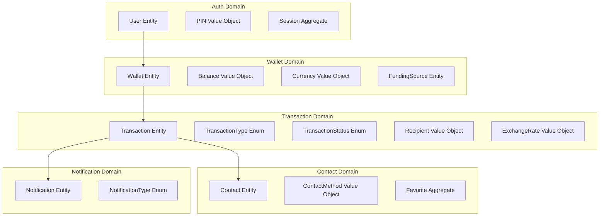

# FastPay ET Wallet

> **Proprietary Project of VersaLabs** — Enterprise-grade cross-border payment mobile application enabling instant remittance between the United States and Ethiopia, deployed for operational scale at a licensed money service business.

[](https://www.typescriptlang.org/)
[](https://reactnative.dev/)
[](https://expo.dev/)
[](https://zustand-demo.pmnd.rs/)

## 📋 Project Overview

FastPay ET Wallet is a sophisticated, production-ready mobile application designed to facilitate seamless cross-border payments between the United States and Ethiopia. Built as an enterprise-grade solution for FastPay LLC (MSB Licensed, NMLS #2327896), this application delivers a pixel-perfect user experience with 60fps animations, comprehensive state management, and robust domain-driven architecture.

### Core Features

- **Instant Cross-Border Transfers**: Real-time money transfers between USD and ETB with live exchange rates
- **Advanced Authentication**: 4-digit PIN with biometric support and session management
- **Comprehensive Wallet Management**: Multi-currency balance tracking, funding sources, and transaction history
- **Contact Integration**: Favorite contacts, transaction history, and fuzzy search capabilities
- **Notification System**: Real-time alerts for transaction status, promotions, and security events
- **Enterprise Security**: MSB-compliant security measures, data encryption, and audit trails

### Architecture Principles

- **Schema-First Development**: All data contracts defined as TypeScript interfaces before implementation
- **Domain-Driven Design (DDD)**: Clear domain boundaries with dedicated business logic layers
- **Factory Pattern**: Reusable component and data generation factories for maximum maintainability
- **60fps Animation System**: UI-thread animations using React Native Reanimated for premium UX
- **Zero Placeholder Design**: Realistic mock data and complete UI implementation for stakeholder demos

## 🛠 Tech Stack

### Core Framework & Runtime
- **Expo SDK 52+**: Managed React Native runtime with custom development builds
- **React Native 0.83.2**: Cross-platform mobile framework
- **TypeScript 5.x**: Strict type safety and schema-first development
- **Expo Router v4**: File-based navigation with native performance

### UI & Animation Engine
- **React Native Reanimated v3**: UI-thread animations, gestures, and transitions
- **React Native Gesture Handler v2**: Advanced touch interactions and pan gestures
- **Expo Linear Gradient**: Smooth gradient backgrounds and brand color transitions
- **Lottie React Native**: Complex micro-interactions and success animations
- **Expo Blur**: Glass-morphism effects and overlay aesthetics
- **Expo Haptics**: Tactile feedback for all interactive elements

### State Management & Data
- **Zustand**: Lightweight, reactive global state container
- **React Native MMKV**: Synchronous key-value persistence with encryption
- **@faker-js/faker**: Realistic mock data generation for development
- **Dayjs**: Efficient date formatting and timezone handling
- **@shopify/flash-list**: 60fps virtualized lists with advanced performance

### Development & Quality
- **ESLint + Prettier**: Code quality and consistent formatting
- **Expo Dev Client**: Custom development builds with hot reloading
- **React Native Safe Area Context**: Proper safe area handling across devices

### Asset & Font Management
- **Expo Google Fonts**: Plus Jakarta Sans typography system
- **Expo Vector Icons**: Ionicons and Material Community Icons
- **React Native SVG**: Custom vector graphics and charts
- **Expo Image**: High-performance image rendering with caching

## 🏗 Architecture Overview

### Domain-Driven Design Structure

The application follows a strict Domain-Driven Design approach with five core domains:



### Project Structure

```
fastpay-ui/
├── app/                                    # Expo Router Screens
│   ├── _layout.tsx                         # Root layout with providers
│   ├── index.tsx                           # Authentication redirect
│   ├── (auth)/                             # Authentication flow
│   ├── (main)/                             # Main authenticated app
│   │   ├── (home)/                         # Home tab with balance/dialpad
│   │   ├── (activity)/                     # Transaction history
│   │   ├── (send)/                         # Send money flow
│   │   ├── (receive)/                      # Receive money screen
│   │   └── (profile)/                      # User profile & settings
│   └── modal/                              # Full-screen modals
├── components/                             # Reusable UI Components
│   ├── core/                               # Atomic design primitives
│   ├── animated/                           # Reanimated-powered components
│   ├── layout/                             # Structural layout components
│   └── composites/                         # Feature-specific compositions
├── domains/                                # Domain Business Logic
│   ├── auth/                               # Authentication domain
│   ├── wallet/                             # Wallet management
│   ├── transactions/                       # Transaction processing
│   ├── contacts/                           # Contact management
│   └── notifications/                      # Notification system
├── store/                                  # Zustand State Stores
├── theme/                                  # Design Token System
├── utils/                                  # Pure Utility Functions
├── constants/                              # Application Constants
├── providers/                              # React Context Providers
├── types/                                  # TypeScript Declarations
├── assets/                                 # Static Assets & Fonts
├── config/                                 # Configuration Files
└── docs/                                  # Documentation
```

### State Architecture

The application uses Zustand for reactive state management with MMKV persistence:

- **useAuthStore**: User session, PIN, biometric authentication
- **useWalletStore**: Balance, funding sources, exchange rates
- **useTransactionStore**: Transaction list, filters, creation
- **useContactStore**: Contact list, favorites, search
- **useNotificationStore**: Notifications, unread counts
- **useUIStore**: Theme, modals, toasts, loading states

### Factory Pattern Implementation

All components and data follow factory patterns for consistency:

```typescript
// Component Factory Example
interface ButtonProps {
  variant: "primary" | "secondary" | "ghost";
  size: "sm" | "md" | "lg";
  label: string;
  onPress: () => void;
}

// Data Factory Example
function createTransaction(overrides?: Partial<ITransaction>): ITransaction {
  return {
    id: generateId(),
    type: "send",
    status: "pending",
    amountCents: 10000,
    currency: "USD",
    // ... complete schema
    ...overrides
  };
}
```

## 📚 Architecture Decision Records (ADRs)

This section documents the key architectural decisions made during the development of FastPay ET Wallet, focusing on Domain-Driven Design principles and enterprise-grade implementation choices.

### ADR 001: Adoption of Domain-Driven Design

**Context**: The application requires clear separation of business concerns, maintainable code structure, and alignment with fintech domain complexity.

**Decision**: Implement Domain-Driven Design (DDD) with bounded contexts for Auth, Wallet, Transactions, Contacts, and Notifications.

**Rationale**:
- Financial applications benefit from explicit domain modeling
- Enables scalable team development with domain experts
- Provides clear boundaries for testing and maintenance
- Aligns with enterprise architecture best practices

**Consequences**:
- Increased initial complexity but long-term maintainability
- Requires domain expert collaboration
- Clear separation enables independent domain evolution

### ADR 002: Schema-First Development Approach

**Context**: API contracts and data structures must be consistent across frontend and backend, with TypeScript providing type safety.

**Decision**: Define all data schemas as TypeScript interfaces first, then derive implementations, factories, and mock data from these schemas.

**Rationale**:
- Ensures frontend-backend contract alignment
- Catches type errors at compile time
- Enables automated mock data generation
- Simplifies API integration when backend is available

**Consequences**:
- Requires disciplined schema maintenance
- Additional upfront design work
- Strong type safety throughout the application

### ADR 003: Factory Pattern for Components and Data

**Context**: UI components and mock data need to be consistent, reusable, and easily testable across different screens and states.

**Decision**: Implement factory patterns for all UI components and domain entities, with variant-based configuration.

**Rationale**:
- Reduces code duplication
- Ensures UI consistency
- Simplifies testing with controlled data generation
- Enables rapid prototyping and iteration

**Consequences**:
- Learning curve for factory usage
- Requires careful factory design
- Excellent for complex, variant-rich UIs

### ADR 004: State Management with Zustand

**Context**: Complex state interactions between domains, persistence requirements, and real-time UI updates.

**Decision**: Use Zustand for global state management with MMKV persistence and middleware for logging and hydration.

**Rationale**:
- Lightweight alternative to Redux with better TypeScript support
- Synchronous updates with automatic React re-renders
- Built-in persistence integration
- Simple API for complex state logic

**Consequences**:
- Requires careful action design for complex flows
- Excellent developer experience
- No boilerplate compared to Redux

### ADR 005: Animation System with React Native Reanimated

**Context**: Premium mobile UX requires 60fps animations, smooth transitions, and gesture-based interactions.

**Decision**: Use React Native Reanimated v3 for all animations, running exclusively on the UI thread.

**Rationale**:
- Ensures smooth 60fps performance on all devices
- Declarative animation API
- Advanced gesture handling capabilities
- Critical for fintech trust and user engagement

**Consequences**:
- Steeper learning curve than CSS animations
- Requires careful performance monitoring
- Superior user experience

### ADR 006: Cross-Platform Development with Expo

**Context**: Need to support both iOS and Android with rapid development cycles and native performance.

**Decision**: Build with Expo managed workflow, custom dev clients, and native modules for advanced features.

**Rationale**:
- Faster development than bare React Native
- Excellent native performance
- Rich ecosystem of pre-built modules
- Simplified deployment and updates

**Consequences**:
- Some native modules may require custom development
- Excellent for most fintech use cases

### ADR 007: Persistence with React Native MMKV

**Context**: Sensitive financial data requires fast, secure local storage with encryption capabilities.

**Decision**: Use React Native MMKV for synchronous key-value storage with encryption.

**Rationale**:
- Extremely fast synchronous operations
- Built-in encryption support
- Cross-platform compatibility
- Better performance than AsyncStorage

**Consequences**:
- Not a full database solution
- Requires careful key management
- Excellent for app state persistence

## 🚀 Installation

### Prerequisites

- Node.js 18.x or later
- npm or yarn package manager
- Expo CLI: `npm install -g @expo/cli`
- iOS Simulator (macOS) or Android Emulator/Device

### Setup

1. **Clone the repository**
   ```bash
   git clone <repository-url>
   cd fastpay-ui
   ```

2. **Install dependencies**
   ```bash
   npm install
   ```

3. **Start the development server**
   ```bash
   npm start
   ```

4. **Run on device/emulator**
   ```bash
   # iOS
   npm run ios

   # Android
   npm run android

   # Web (for development)
   npm run web
   ```

## 📱 Usage

### Development Workflow

1. **Start Expo Dev Client**: `npm start`
2. **Scan QR code** with Expo Go app on device
3. **Hot reload** enabled for instant updates
4. **Custom dev builds** available for advanced native features

### Key Screens & Flows

- **Authentication**: PIN setup, biometric login, session management
- **Home Dashboard**: Balance display, currency toggle, quick actions
- **Send Money**: Amount entry, recipient selection, review & confirmation
- **Transaction History**: Filterable list with detailed transaction views
- **Profile Management**: Settings, linked accounts, security preferences

### Mock Data

The application uses realistic mock data for demonstration:
- 50+ Ethiopian and US contacts
- 300+ transaction records with various statuses
- Live exchange rate simulation (ETB/USD)
- Notification history and preferences

## 🤝 Contributing

This is a proprietary VersaLabs project. Contributions are managed through internal processes:

1. **Code Standards**: Follow ESLint and Prettier configurations
2. **Type Safety**: Maintain strict TypeScript compliance
3. **Testing**: Add unit tests for new components and utilities
4. **Documentation**: Update architecture docs for significant changes
5. **Reviews**: All changes require peer review and approval

## 📄 License

**Proprietary Software** — Copyright © 2026 VersaLabs. All rights reserved.

This software is the confidential and proprietary information of VersaLabs and may not be disclosed, reproduced, or distributed without prior written permission.

## 🔗 Links

- **Live Demo**: Coming soon
- **Documentation**: See `docs/` directory for detailed architecture specifications
- **Support**: Internal VersaLabs support channels

---

*Built with ❤️ by VersaLabs for FastPay LLC*